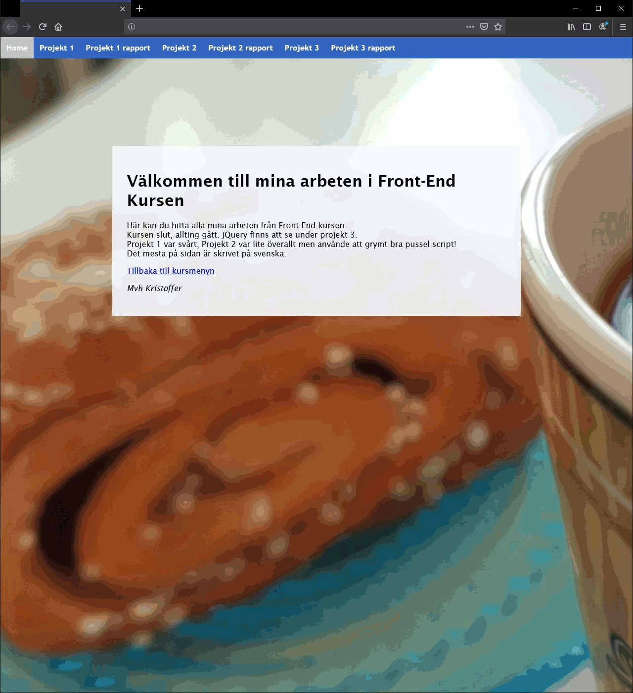

# School-Front-end-programmering.Projects01-03
###### PROJECTS 01 - 03
All projects in the course Front-end Programming, which was the second course we took @Arcada in web design that focused on JavaScript.
Most things should be in Swedish, sorry for any inconvenience.
Some parts are credited in the comments of the code to original authors/tutorials!
* Like the original code for the amazing puzzle from "St33d" over @TIGForums!

## Installation
Just download and open!

## Preview

## Grades
###### Project 01
63/68
###### Project 02
85/90
###### Project 03
86/90

## Contribution
School project, won't be updated but constructive criticism is welcome.

